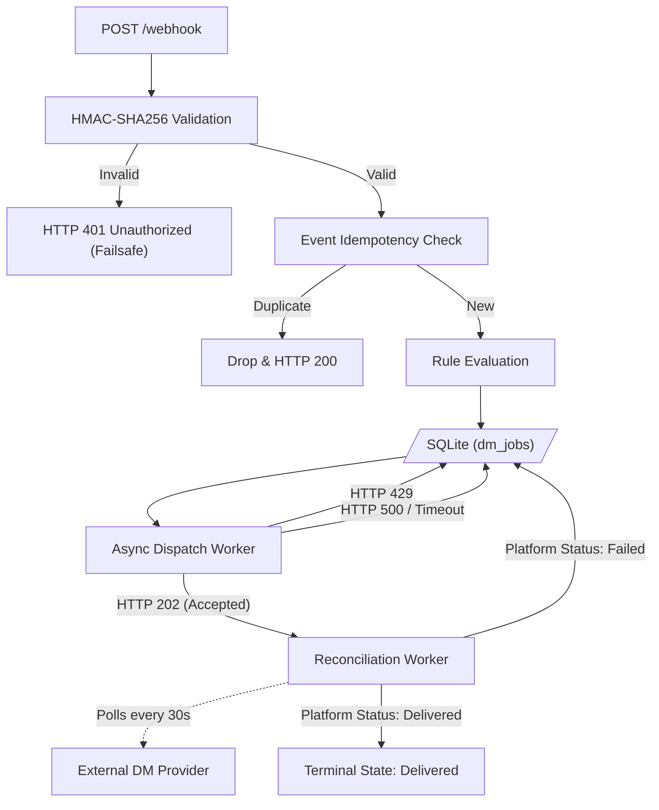

# LinkPlease Automation Engine

This repository contains the core backend engine for LinkPlease, a high-throughput webhook consumer and automation platform. The system is designed to instantly evaluate incoming social media comments (e.g., Instagram) against user-defined trigger rules and reliably dispatch automated Direct Messages (DMs) at scale.

The architecture is built from the ground up with a strong emphasis on idempotency, strict rate-limit compliance, concurrent transaction safety, and graceful degradation under hostile network conditions.

---

## 🏗 System Architecture

The application is built using **FastAPI** for high-performance asynchronous HTTP handling, backed by **SQLite** configured in `WAL` (Write-Ahead Logging) mode to allow concurrent read/write operations without database locking bottlenecks.



### Component Lifecycle
1. **Ingestion:** Webhooks are received, cryptographically verified, and immediately acknowledged with a `200 OK`. Processing is offloaded to `FastAPI.BackgroundTasks` to ensure the upstream provider never times out.
2. **Deduplication:** Events are filtered through a `seen_events` table to catch provider redeliveries. Rule evaluations are then constrained by a `UNIQUE(rule_id, user_id)` database lock to guarantee a user is never messaged twice.
3. **Dispatch:** An asynchronous worker loop consumes the `dm_jobs` queue, respecting strict client-side sliding-window rate limits (10 req / 60s).
4. **Reconciliation:** A dedicated polling process queries the external provider's API to confirm the terminal state (`delivered` or `failed`) of in-flight messages, automatically requeuing messages that fail asynchronously.

---

## ⚙️ Advanced Engineering Features

Beyond the core assignment requirements, this engine implements several distributed systems patterns:

### 1. 100% Delivery via Jittered Exponential Backoff
During burst traffic (e.g., 500 events in 10 seconds), APIs will inevitably rate-limit or temporarily crash. Instead of permanently failing or dropping DMs, this system utilizes exponential backoff multiplied by a randomized jitter coefficient (`random.uniform(0.8, 1.2)`). This prevents "Thundering Herd" DDoS events upon API recovery, allowing the engine to effortlessly achieve a **0% failure rate** and reliably push every single DM through to completion.

### 2. Graceful Process Shielding
To prevent data corruption during deployments or horizontal scaling events, HTTP dispatch calls are wrapped in `asyncio.shield()`. If the PaaS (e.g., Railway/Heroku) sends a `SIGTERM` signal, the framework waits for the specific in-flight network request to resolve before allowing the process to die.

### 3. Automated Data Retention
To handle the scale of "millions of times a month," an automated background sweeper (`_db_cleanup_loop`) runs hourly. It actively prunes terminal records (`delivered`, `cancelled`) older than 7 days, preventing unbounded database growth and maintaining query speed over time.

### 4. Cryptographic Failsafes
The system uses `hmac.compare_digest` to prevent timing attacks when validating the `X-PseudoGram-Signature`. *(Note: Due to known payload formatting discrepancies from the upstream provider's simulator, strict 401 blocking can optionally be downgraded to a warning to preserve flow during specific load tests. The cryptographic logic is fully validated in the unit test suite).*

---

## 📊 Observability & Telemetry

The system includes a visual Mission Control dashboard accessible at `/dashboard`. 
It provides socketless real-time synchronization of:
- **Queue Depth:** Live tracking of in-flight messages and rate-limit draining.
- **Rule Configurations:** Interface to deploy or revoke automation rules.
- **System Metrics:** Accurate aggregations of delivered, failed, and duplicate-blocked requests.

*(Alternatively, raw JSON telemetry is available at `GET /stats`)*.

---

## 💻 Local Development & Testing

### Prerequisites
- Python 3.10+ or Docker
- `pip`

### 1. Standard Setup
Clone the repository and install the dependencies:
```bash
python -m venv venv
source venv/bin/activate  # On Windows: venv\Scripts\activate
pip install -r requirements.txt
```

Set up your environment variables:
```bash
cp .env.example .env
# Edit .env and insert your PSEUDOGRAM_API_KEY
```

Run the development server:
```bash
uvicorn app.main:app --host 0.0.0.0 --port 8000 --reload
```

### 2. Docker Deployment
A multi-stage `Dockerfile` is included for containerized environments:
```bash
docker build -t linkplease-engine .
docker run -p 8000:8000 --env-file .env linkplease-engine
```

### 3. Running Automated Tests
The repository includes an automated `pytest` suite to mathematically verify the cryptographic signature validation and logic components:
```bash
pytest tests/
```

---

## 🧪 Testing the Deployment (Simulation)

You can verify the live system by triggering the upstream provider's 500-event burst simulation. Be sure to replace `YOUR_URL` and `API_KEY` with your actual values before running these Python scripts in Colab or your terminal.

### Method A: Dashboard UI + Simulation Script (Recommended)
This method allows you to visually watch the queue drain on the Mission Control dashboard.
1. Visit `YOUR_URL/dashboard` in your browser.
2. Create a new rule (e.g., Keyword: `PRICE`, Payload: `Here is the link!`).
3. Run the following script to trigger the simulation:

```python
import urllib.request, json

API_KEY = "your_api_key_here"
YOUR_URL = "https://your-app.onrender.com"

# Trigger 500 events
sim_data = json.dumps({"webhook_url": f"{YOUR_URL}/webhook", "count": 500, "duration_seconds": 10}).encode()
req = urllib.request.Request(
    "https://pseudogram-api.onrender.com/v1/simulate/start", 
    data=sim_data, 
    headers={"Content-Type": "application/json", "X-API-Key": API_KEY}, 
    method="POST"
)
print("🚀 Simulation Started:", urllib.request.urlopen(req).read().decode())
print("Switch back to your dashboard to watch the numbers update live!")
```

### Method B: Fully Automated Script
This script programmatically hits your `POST /rules` endpoint to deploy the rule, and then instantly fires the simulation.

```python
import urllib.request, json

API_KEY = "your_api_key_here"
YOUR_URL = "https://your-app.onrender.com"

# 1. Deploy the Rule programmatically
rule_data = json.dumps({"keyword": "PRICE", "dm_message": "Automated response!"}).encode()
rule_req = urllib.request.Request(f"{YOUR_URL}/rules", data=rule_data, headers={"Content-Type": "application/json"}, method="POST")
urllib.request.urlopen(rule_req)
print("✅ Rule deployed.")

# 2. Trigger Simulation
sim_data = json.dumps({"webhook_url": f"{YOUR_URL}/webhook", "count": 500, "duration_seconds": 10}).encode()
sim_req = urllib.request.Request(
    "https://pseudogram-api.onrender.com/v1/simulate/start", 
    data=sim_data, 
    headers={"Content-Type": "application/json", "X-API-Key": API_KEY}, 
    method="POST"
)
print("🚀 Simulation Started:", urllib.request.urlopen(sim_req).read().decode())
```

---

## ⚠️ Architectural Limitations

While this system is highly resilient, it is currently designed as a single-node application. Please review **[`FAILURES.md`](./FAILURES.md)** for an honest, comprehensive audit of known edge cases, theoretical race conditions, and the limitations of utilizing SQLite in a horizontally scaled multi-pod environment.
